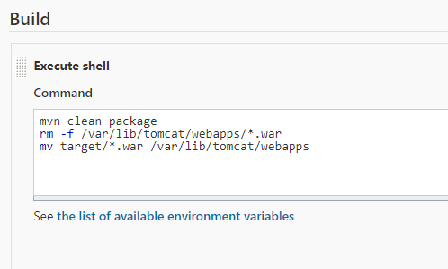
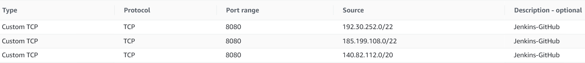

# HelloJenkins

## Summary
This repository is an introduction to using Jenkins to push a repository onto an AWS EC2. There are also notes and images for setting up an AWS EC2, an AWS RDS, and Jenkins on an EC2. Docker notes can be found in this repository as well. A webhook is needed to 
## Steps
1. Login on AWS website (i.e. sign into console). You can [click here](https://aws.amazon.com/) to get onto the AWS website.
2. Setup an AWS EC2 if you don't have one already
3. Install Java 8, Maven, Git, Tomcat, and Jenkins on the EC2
4. Complete Jenkins setup on the EC2
5. Create webhook in repository (See instructions below)
6. Clone the GitHub repository link (https://github.com/username/RepoName.git) 
7. Get into the EC2 on your computer and start Jenkins if Jenkins isn't already running. See HelloJenkins/AWS_Setup/EC2_Setup_Notes.txt.
8. Enter http://Location_Of_The_EC2_ON_The_Internet:8080 into a web browser
9. Log into Jenkins in the web browser (see notes)
10. Click Create a job in the Jenkins Dashboard
11. Give the job a name (say FirstPipeline), select Freestyle Project, and click OK
12. Select Git for your Code Source Management
13. Paste the clone link in step 6 where it says Repository URL
14. For the branch specifier, make sure it says */master or */main (whatever the main branch is called when the GitHub repo was created)
15. Under Build Triggers, select GitHub hook trigger for GITScm polling
16. Add a build step and select Execute shell
17. In the shell, enter the following commands to tell Jenkins how to build your project

18. Click save
19. Next, make sure the EC2 can communicate with GitHub by adding the three GitHub IP addresses below to your security group in AWS. These are the IP addresses that Git will send information from.

20. In the pom.xml of your application, add <build><finalName>ProjectName</finalName></build> so that Maven will package it as ProjectName.war
21. Now, push to your repository and let Jenkins build it on the EC2
22. Check the Jenkins page to see if the build was successful
23. If successful, enter  http://Location_Of_The_EC2_ON_The_Internet:8080/ProjectName/url-pattern into your web browser
## Setting Up a Webhook
* In the repository, click on the Settings tab
* Select the Webhooks tab
* Click on Add webhook
* Conirm your password if needed
* Insert a Payload URL
    * Enter http://Location_Of_The_EC2_ON_The_Internet:8080/github-webhook/
    * That last '/' is important
    * Note that 8080 is Jenkins' default port
    * Thus, the Payload URL is the location of Jenkins on the EC2
* Leave everything else alone and click Add webhook